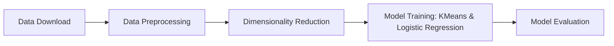
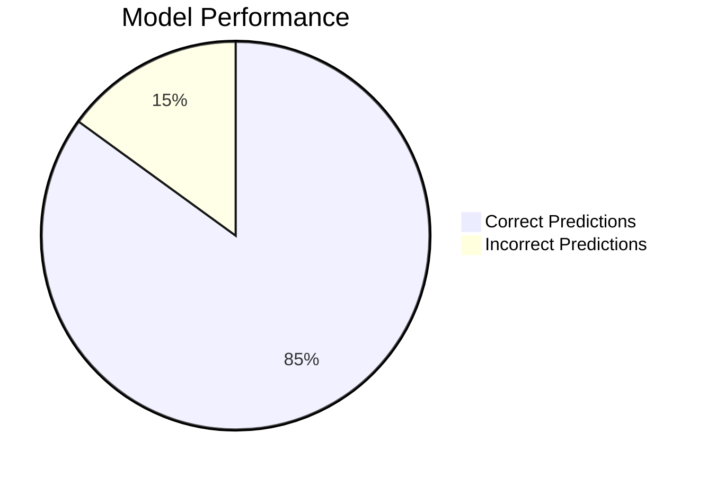

# 🚀 Dimensionality Reduction Project

## 📝 Overview
This project focuses on applying dimensionality reduction techniques to the **Human Activity Recognition (HAR)** dataset using smartphones. It integrates data preprocessing, clustering, and classification to identify human activities from smartphone sensor data.

## ✨ Key Features
- 📥 **Data Collection:** Automated data download and extraction from the UCI repository.
- 🛠️ **Preprocessing:** Feature scaling and encoding for model readiness.
- 🔍 **Dimensionality Reduction:** Integration with clustering and classification models.
- 📊 **Model Evaluation:** Performance assessment using accuracy and classification reports.

## 🔄 Project Workflow



## ⚙️ Installation

1. Clone the repository:
    ```bash
    git clone https://github.com/yourusername/dimensionality-reduction-project.git
    cd dimensionality-reduction-project
    ```

2. Install the required packages:
    ```bash
    pip install -r requirements.txt
    ```

## ▶️ Usage

1. Run the Jupyter Notebook:
    ```bash
    jupyter notebook Dimensionality_Reduction_Skeleton_Code_Day_5.ipynb
    ```

2. Follow the notebook to download, preprocess data, and train models.

## 🛠️ Technologies Used

- **Python** 🐍  
- **Pandas**, **NumPy**: 📊 Data handling and processing  
- **Scikit-learn**: 🤖 Machine learning models  
- **BeautifulSoup**, **Requests**: 🌐 Web scraping  
- **Matplotlib**, **Seaborn**: 📈 Visualization  

## 📈 Results

Model evaluation results are displayed in the notebook with metrics such as **Accuracy** and **Classification Reports**.

## 📊 Visualizations



## 📄 License
This project is licensed under the MIT License.

## 🙏 Acknowledgements
- 📚 UCI Machine Learning Repository for the HAR dataset.
- ⚙️ Scikit-learn for providing robust machine learning tools.


